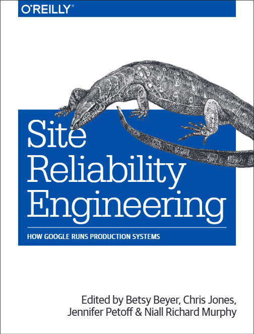

## Reading
| Title |Progress |Page |
|--|--|--|
| Effective Python |▓▓▓▓▓▓▓░░░░░░░░░░░░░░░░░░░░░░░ 23% |112/472 |
| Site Reliability Engineering |▓▓▓░░░░░░░░░░░░░░░░░░░░░░░░░░░ 11% |63/550 |

## Complete
| Title |Author |Progress |Page |
|--|--|--|--|
| DevOps HandBook |Gene Kim |▓▓▓▓▓▓▓▓▓▓▓▓▓▓▓▓▓▓▓▓▓▓▓▓▓▓▓▓▓▓ 100% |434/434 |

## Interested
| Title |
|--|
| Atomic Habits |

