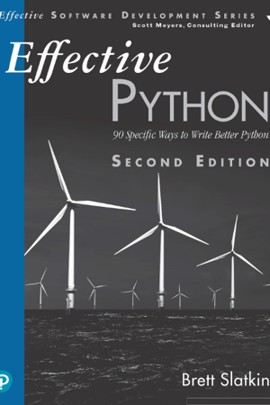
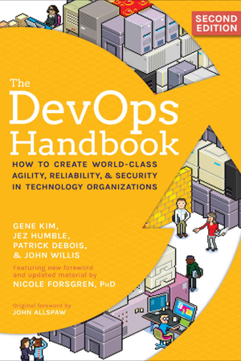
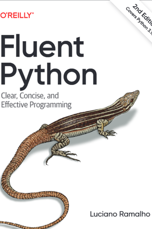

## About `book_tracker`
- `book_tracker` is a `YAML` configured book tracker, that renders to markdown, targeted for `gfm`.  
- It is meant to be very high level, while still providing a solid level of customization.  
  
## How to setup  
- Fork this repo  
- Configure `book_process.yaml`  
- (Optional) Configure `config.yaml`  
  
### `book_process.yaml` fields  
```yaml  
book_data:  
  - heading: heading name  
    heading_depth: 4  
      
  cover_art:  
    scale: scale of cover art, or set in config globally  
  comment_before: comment before books  
  comment_after: comment after books  
  
  books:  
  - title: book title  
    auther: author  
    page: current page  
    total_pages: total pages  
    cover_art: name_of_cover_art.png  
```  
  
### `config.yaml` fields  
```yaml  
config:  
  progress_bar:  
    length: length of bar  
    fill_char: fill emoji  
    empty_char: unfilled emoji  
  global_cover_art:  
    scale: scale multiplier  
    width: width in px  
    height: height in px  
```

## Reading

| Title |Author |Progress |Page |
|--|--|--|--|
|Effective Python |Brett Slatkin |███████░░░░░░░░░░░░░░░░░░░░░░░░ 23% |112/472 |
|Site Reliability Engineering |Google |████░░░░░░░░░░░░░░░░░░░░░░░░░░░ 14% |82/550 |
|Kubernetes 101 |Jeff Geerling |█████████████░░░░░░░░░░░░░░░░░░ 42% |55/128 |
|The Code Book |Simon Singh |██████████░░░░░░░░░░░░░░░░░░░░░ 34% |93/273 |
<p align='left'></p>


## Read
Book I've read.
<p align='left'></p>


## Future
Future books I'll read.
<p align='left'></p>


#### Investigate Further

<p align='left'></p>


