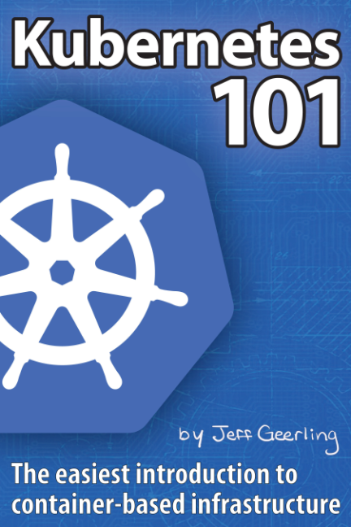

## Reading
| Title |Author |Progress |Page |
|--|--|--|--|
|Effective Python |Brett Slatkin |███░░░░░░░░░░░░ 23% |112/472 |
|Site Reliability Engineering |Google |██░░░░░░░░░░░░░ 14% |82/550 |
|Kubernetes 101 |Jeff Geerling |██████░░░░░░░░░ 41% |53/128 |

## Read

## Future

